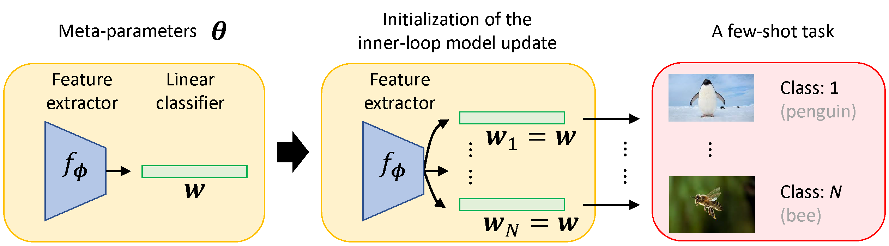

# How to Train Your MAML to Excel in Few-Shot Classification

The code repository for "How to Train Your MAML to Excel in Few-Shot Classification" (Submitted to NeurIPS 2021) in PyTorch. 

## Main idea of UNICORN-MAML

Model-agnostic meta-learning (MAML) is arguably the most popular meta-learning algorithm nowadays, given its flexibility to incorporate various model architectures and to be applied to different problems. Nevertheless, its performance on few-shot classification is far behind many recent algorithms dedicated to the problem. In this paper, we point out several key facets of how to train MAML to excel in few-shot classification. First, we find that a large number of gradient steps are needed for the inner loop update, which contradicts the common usage of MAML for few-shot classification. Second, we find that MAML is sensitive to the permutation of class assignments in meta-testing: for a few-shot task of N classes, there are exponentially many ways to assign the learned initialization of the N-way classifier to the N classes, leading to an unavoidably huge variance. Third, we investigate several ways for permutation invariance and find that learning a shared classifier initialization for all the classes performs the best. On benchmark datasets such as *Mini*ImageNet and *Tiered*ImageNet, our approach, which we name UNICORN-MAML, performs on a par with or even outperforms state-of-the-art algorithms, **while keeping the simplicity of MAML without adding any extra sub-networks**.

## Standard Few-shot Learning Results

Experimental results on few-shot learning datasets with ResNet-12 backbone (Same as the [MetaOptNet](https://github.com/kjunelee/MetaOptNet)). We report average results with 10,000 randomly sampled few-shot learning episodes for stablized evaluation.

**MiniImageNet Dataset**
|  Setups  | 1-Shot 5-Way | 5-Shot 5-Way |
|:--------:|:------------:|:------------:|
| ProtoMAML |     62.62    |     79.24    |
|  MetaOptNet  |     62.64    |     78.63    |
| DeepEMD |     65.91    |     82.41    |
|    FEAT   |     **66.78**  |     82.05    |
|    MAML   |     64.42  |     83.44    |
|   UNICORN-MAML   |   65.17  |   **84.30**  |

**TieredImageNet Dataset**

|  Setups  | 1-Shot 5-Way | 5-Shot 5-Way |
|:--------:|:------------:|:------------:|
| ProtoMAML |     67.10   |     81.18    |
|  MetaOptNet  |     65.99    |     81.56   |
| DeepEMD |     **71.52**    |     86.03    |
|   FEAT   |   70.80  |   84.79  |
|    MAML   |     65.72    |     84.37    |
| UNICORN-MAML   |     69.24    |     **86.06**    |

## Prerequisites

The following packages are required to run the scripts:

- [PyTorch-1.6 and torchvision](https://pytorch.org)

- Package [tensorboardX](https://github.com/lanpa/tensorboardX)

- Dataset: please download the dataset and put images into the folder data/[name of the dataset, miniimagenet or cub]/images

- Pre-trained weights: We use the released weights of [FEAT](https://drive.google.com/file/d/1XcUZMNTQ-79_2AkNG3E04zh6bDYnPAMY/view?usp=sharing).

## Dataset

### MiniImageNet Dataset

The MiniImageNet dataset is a subset of the ImageNet that includes a total number of 100 classes and 600 examples per class. We follow the [previous setup](https://github.com/twitter/meta-learning-lstm), and use 64 classes as *base* categories, 16 and 20 as two sets of *novel* categories for model validation and evaluation, respectively.

### TieredImageNet Dataset

[TieredImageNet](https://github.com/renmengye/few-shot-ssl-public) is a large-scale dataset  with more categories, which contains 351, 97, and 160 categoriesfor model training, validation, and evaluation, respectively.

## Code Structures
To reproduce our experiments with UNICORN-MAML, please use **train_fsl.py**. There are four parts in the code.
 - `model`: It contains the main files of the code, including the few-shot learning trainer, the dataloader, the network architectures, and baseline and comparison models.
 - `data`: Images and splits for the data sets.
 - `saves`: The pre-trained weights of different networks.
 - `checkpoints`: To save the trained models.

## Model Training and Evaluation
Please use **train_fsl.py** and follow the instructions below. The file will automatically evaluate the model on the meta-test set with 10,000 tasks after given epochs.

## Arguments
The train_fsl.py takes the following command line options (details are in the `model/utils.py`):

**Task Related Arguments**
- `dataset`: Option for the dataset (`MiniImageNet`, `TieredImageNet`, or `CUB`), default to `MiniImageNet`

- `way`: The number of classes in a few-shot task during meta-training, default to `5`

- `eval_way`: The number of classes in a few-shot task during meta-test, default to `5`

- `shot`: Number of instances in each class in a few-shot task during meta-training, default to `1`

- `eval_shot`: Number of instances in each class in a few-shot task during meta-test, default to `1`

- `query`: Number of instances in each class to evaluate the performance during meta-training, default to `15`

- `eval_query`: Number of instances in each class to evaluate the performance during meta-test, default to `15`

**Optimization Related Arguments**
- `max_epoch`: The maximum number of training epochs, default to `200`

- `episodes_per_epoch`: The number of tasks sampled in each epoch, default to `100`

- `num_eval_episodes`: The number of tasks sampled from the meta-val set to evaluate the performance of the model (note that we fix sampling 10,000 tasks from the meta-test set during final evaluation), default to `200`

- `lr`: Learning rate for the model, default to `0.001` with pre-trained weights

- `lr_mul`: This is specially designed for set-to-set functions like FEAT. The learning rate for the top layer will be multiplied by this value (usually with faster learning rate). Default to `10`

- `lr_scheduler`: The scheduler to set the learning rate (`step`, `multistep`, or `cosine`), default to `step`

- `step_size`: The step scheduler to decrease the learning rate. Set it to a single value if choose the `step` scheduler and provide multiple values when choosing the `multistep` scheduler. Default to `20`

- `gamma`: Learning rate ratio for `step` or `multistep` scheduler, default to `0.1`

- `fix_BN`: Set the encoder to the evaluation mode during the meta-training. This parameter is useful when meta-learning with the WRN. Default to `False`

- `mom`: The momentum value for the SGD optimizer, default to `0.9`

- `weight_decay`: The weight_decay value for SGD optimizer, default to `0.0005`

**Model Related Arguments**
- `model_class`: The model to use during meta-learning. We provide implementations for `MAML` and our`UNICORN-MAML`. Default to `MAML`

- `backbone_class`: Types of the encoder, i.e., ResNet-12 (`Res12`), default to `ConvNet`

- `temperature`: Temperature over the logits, we #divide# logits with this value. It is useful when meta-learning with pre-trained weights. Default to `0.5`

**Other Arguments** 

- `gpu`: The index of GPU to use. Please provide multiple indexes if choose `multi_gpu`. Default to `0`

- `log_interval`: How often to log the meta-training information, default to every `50` tasks

- `eval_interval`: How often to validate the model over the meta-val set, default to every `1` epoch

- `save_dir`: The path to save the learned models, default to `./checkpoints`

Running the command without arguments will train the models with the default hyper-parameter values. Loss changes will be recorded as a tensorboard file.

## Training scripts for UNICORN-MAML

For example, to train the 1-shot/5-shot 5-way MAML/UNICORN-MAML model with ResNet-12 backbone on MiniImageNet:

    $ python train_fsl.py --max_epoch 100 --way 5 --eval_way 5 --lr_scheduler step --model_class MAML --lr_mul 10 --backbone_class Res12 --dataset MiniImageNet --gpu 0 --query 15 --step_size 20 --gamma 0.1 --para_init './saves/initialization/miniimagenet/Res12-pre.pth' --lr 0.001 --shot 1 --eval_shot 1  --temperature 0.5 --gd_lr 0.05 --inner_iters 15
	$ python train_fsl.py --max_epoch 100 --way 5 --eval_way 5 --lr_scheduler step --model_class MAML --lr_mul 10 --backbone_class Res12 --dataset MiniImageNet --gpu 0 --query 15 --step_size 20 --gamma 0.1 --para_init './saves/initialization/miniimagenet/Res12-pre.pth' --lr 0.001 --shot 5 --eval_shot 5  --temperature 0.5 --gd_lr 0.1 --inner_iters 20 
	$ python train_fsl.py --max_epoch 100 --way 5 --eval_way 5 --lr_scheduler step --model_class MAMLOne --lr_mul 10 --backbone_class Res12 --dataset MiniImageNet --gpu 0 --query 15 --step_size 20 --gamma 0.1 --para_init './saves/initialization/miniimagenet/Res12-pre.pth' --lr 0.001 --shot 1 --eval_shot 1  --temperature 0.5 --gd_lr 0.1 --inner_iters 5 
	$ python train_fsl.py --max_epoch 100 --way 5 --eval_way 5 --lr_scheduler step --model_class MAMLOne --lr_mul 10 --backbone_class Res12 --dataset MiniImageNet --gpu 0 --query 15 --step_size 20 --gamma 0.1 --para_init './saves/initialization/miniimagenet/Res12-pre.pth' --lr 0.001 --shot 5 --eval_shot 5  --temperature 0.5 --gd_lr 0.1 --inner_iters 20 

to train the 1-shot/5-shot 5-way MAML/UNICORN-MAML model with ResNet-12 backbone on TieredImageNet:

    $ python train_fsl.py --max_epoch 100 --way 5 --eval_way 5 --lr_scheduler step --model_class MAML --lr_mul 10 --backbone_class Res12 --dataset TieredImageNet --gpu 0 --query 15 --step_size 20 --gamma 0.1 --para_init './saves/initialization/tieredimagenet/Res12-pre.pth' --lr 0.001 --shot 1 --eval_shot 1  --temperature 0.5 --gd_lr 0.01 --inner_iters 20
	$ ../../anaconda3/bin/python3.#7 train_fsl.py --max_epoch 100 --way 5 --eval_way 5 --lr_scheduler step --model_class MAML --lr_mul 10 --backbone_class Res12 --dataset TieredImageNet --gpu 0 --query 15 --step_size 20 --gamma 0.1 --para_init './saves/initialization/tieredimagenet/Res12-pre.pth' --lr 0.001 --shot 1 --eval_shot 5  --temperature 0.5 --gd_lr 0.05 --inner_iters 15
	$ python train_fsl.py --max_epoch 100 --way 5 --eval_way 5 --lr_scheduler step --model_class MAMLOne --lr_mul 10 --backbone_class Res12 --dataset TieredImageNet --gpu 0 --query 15 --step_size 20 --gamma 0.1 --para_init './saves/initialization/tieredimagenet/Res12-pre.pth' --lr 0.001 --shot 5 --eval_shot 1  --temperature 0.5 --gd_lr 0.02 --inner_iters 10
	$ python train_fsl.py --max_epoch 100 --way 5 --eval_way 5 --lr_scheduler step --model_class MAMLOne --lr_mul 10 --backbone_class Res12 --dataset TieredImageNet --gpu 0 --query 15 --step_size 20 --gamma 0.1 --para_init './saves/initialization/tieredimagenet/Res12-pre.pth' --lr 0.001 --shot 1 --eval_shot 5  --temperature 0.5 --gd_lr 0.05 --inner_iters 20 

## Verifying the permutation variance of a learned MAML model

We can evaluate a learned MAML model and check whether the permutation will introduce large variance. For example, 1-shot/5-shot 5-way model with ResNet-12 backbone on MiniImageNet:

	$ python eval_maml_permutation.py --shot_list 1 --model_path './MAML-1-shot.pth' --gpu 0 --gd_lr 0.05 --inner_iters 15  --model_class MAML --dataset MiniImageNet
	$ python eval_maml_permutation.py --shot_list 5 --model_path './MAML-5-shot.pth' --gpu 0 --gd_lr 0.1 --inner_iters 20  --model_class MAML --dataset MiniImageNet

## Acknowledgment
We thank the following repos providing helpful components/functions in our work.

- [FEAT](https://github.com/Sha-Lab/FEAT)